<p align="center">
  
</p>

<h1 align="center">
  
</h1>

<p align="center">
  <a href="https://online-multiplayer-game-socket-io.onrender.com/">
    
  </a>
</p>

<p align="center">
  
  
  
</p>

<br/>

<p align="center">
  
  
  
  
  
  
</p>

<p align="center">
  <a href="#-features"></a>
  <a href="#-quick-start"></a>
  <a href="#-screenshots"></a>
  <a href="#-tech-stack"></a>
  <a href="#-architecture"></a>
</p>

---

<br/>

## 🎮 What is Stickman Race?

<table>
<tr>
<td width="55%">

**Stickman Race** is an exciting **real-time multiplayer racing game** where players compete as stickman characters across procedurally generated obstacle courses! 

🏃 **Race against friends** in real-time  
🎯 **Dodge obstacles** and jump over barriers  
🪢 **Swing on ropes** to cross gaps  
🏆 **Be the first** to cross the finish line!

Every race is unique with **procedurally generated maps** and multiple race lengths from 100m to 1000m!

</td>
<td width="45%">

<p align="center">
  
</p>

</td>
</tr>
</table>

---

<br/>

## ✨ Features

<table>
<tr>
<td align="center" width="25%">

<br/><strong>🎯 Multiplayer</strong>
<br/><sub>Real-time racing with friends</sub>
</td>
<td align="center" width="25%">

<br/><strong>🗺️ Procedural Maps</strong>
<br/><sub>Every race is unique</sub>
</td>
<td align="center" width="25%">

<br/><strong>📱 Mobile Ready</strong>
<br/><sub>Touch controls included</sub>
</td>
</tr>
</table>

<br/>

### 🎨 Visual Effects

| Effect | Description |
|--------|-------------|
| 📸 **Camera Shake** | Dynamic screen shake for impactful moments |
| ✨ **Particles** | Visual feedback for jumps, slides, and collisions |
| ⏱️ **Countdown** | Animated 3-2-1-GO! before race start |
| 🌳 **Environment** | Trees, grass, and scenic backgrounds |

### 🕹️ Player Mechanics

| Action | Description |
|--------|-------------|
| 🦘 **Jump** | Leap over obstacles with smooth animations |
| 🛷 **Slide** | Duck under barriers and speed through |
| 🪢 **Rope Swing** | Physics-based rope swinging across gaps |
| ⚡ **Speed Boost** | Momentum-based acceleration |

### 📏 Race Distances

| Distance | Difficulty | Time |
|----------|------------|------|
| 🟢 **100m** | Easy | ~30 sec |
| 🟡 **250m** | Medium | ~1 min |
| 🟠 **500m** | Hard | ~2 min |
| 🔴 **1000m** | Extreme | ~4 min |

---

<br/>

## 📸 Screenshots

<table align="center">
<tr>
<td align="center">
  
  <br/><br/>
  <strong>🏟️ Game Lobby</strong>
  <br/><sub>Invite friends and prepare for the race</sub>
</td>
<td align="center">
  
  <br/><br/>
  <strong>🎮 Game Room</strong>
  <br/><sub>Custom settings and controls</sub>
</td>
</tr>
</table>

<br/>

<table align="center">
<tr>
<td align="center">🏠</td>
<td align="center">🏟️</td>
<td align="center">🏃</td>
<td align="center">🏆</td>
</tr>
<tr>
<td align="center"><b>Home</b></td>
<td align="center"><b>Lobby</b></td>
<td align="center"><b>Racing</b></td>
<td align="center"><b>Victory</b></td>
</tr>
<tr>
<td align="center"><sub>Enter name & join</sub></td>
<td align="center"><sub>Wait for players</sub></td>
<td align="center"><sub>Real-time action</sub></td>
<td align="center"><sub>Winner screen</sub></td>
</tr>
</table>

---

<br/>

## 🚀 How to Run

You can run this game in two ways. Choose the one you prefer!

### Option 1: The Docker Way (Recommended 🐳)
*No need to install Node.js! Just requires Docker Desktop.*

1.  **Clone the repo**:
    ```bash
    git clone https://github.com/shaurya-tiwari/stickman-race.git
    cd stickman-race
    ```
2.  **Run with one command** (Command Prompt or Terminal):
    ```bash
    docker compose up
    ```
3.  **Play**: Open `http://localhost:8080` in your browser.

> **Note**: If you want to run it in the background, use `docker compose up -d`.

---

### Option 2: The Manual Way (Node.js)
*Requires Node.js v18+ installed on your machine.*

1.  **Clone the repo**:
    ```bash
    git clone https://github.com/shaurya-tiwari/stickman-race.git
    cd stickman-race
    ```

2.  **Install & Run Server**:
    ```bash
    cd server
    npm install
    npm run dev
    ```

3.  **Install & Run Client** (New Terminal):
    ```bash
    cd client
    npm install
    npm run dev
    ```

4.  **Play**: Open `http://localhost:5173` (or whatever Vite shows).

---

<br/>

## 🛠️ Tech Stack

<table align="center">
<tr>
<td align="center" width="140">
<br/>
<b>React 18</b>
</td>
<td align="center" width="140">
<br/>
<b>Vite 5</b>
</td>
<td align="center" width="140">
<br/>
<b>Tailwind</b>
</td>
<td align="center" width="140">
<br/>
<b>Node.js</b>
</td>
<td align="center" width="140">
<br/>
<b>Express</b>
</td>
<td align="center" width="140">
<br/>
<b>Docker</b>
</td>
</tr>
</table>

<br/>

### 📋 Full Stack Details

| Layer | Technology | Version | Purpose |
|-------|------------|---------|---------|
| **Frontend** | React | 18.3.1 | UI Components |
| | Vite | 5.3.1 | Build Tool |
| | Tailwind CSS | 3.4.4 | Styling |
| | Socket.IO Client | 4.7.5 | Real-time |
| **Backend** | Node.js | 18+ | Runtime |
| | Express | 5.2.1 | Server |
| | Socket.IO | 4.8.3 | WebSockets |
| | CORS | 2.8.5 | Security |
| **DevOps** | Docker | Latest | Containerization |

---

<br/>

## 🏗️ Architecture

```
📦 stickman-race/
│
├── 🎨 client/                    # React Frontend
│   └── src/
│       ├── 📁 screens/           # HomeScreen, LobbyScreen, GameScreen
│       ├── 📁 components/        # MobileControls, GameOverOverlay
│       ├── 📁 game/              # gameLoop, physics, collisions
│       ├── 📁 game-features/     # cameraShake, countdown, effects
│       └── 📁 assets/            # sprites, backgrounds, sounds
│
├── ⚙️ server/                    # Node.js Backend
│   ├── index.js                  # Express server
│   ├── socket.js                 # Socket.IO events
│   ├── rooms.js                  # Room management
│   └── mapGenerator.js           # Procedural generation
│
└── 📸 screenshots/               # Game screenshots
```

---

<br/>

## 🎯 Game Flow

```mermaid
graph LR
    A[🏠 Home] -->|Host/Join| B[🏟️ Lobby]
    B -->|Start| C[⏳ Countdown]
    C --> D[🏃 Race!]
    D -->|Finish| E[🏆 Winner!]
    E -->|Restart| B
```



---

<br/>

## 🤝 Join the Community!

<p align="center">
  
</p>

<p align="center">
  <b>We're building something awesome and YOU can be part of it!</b><br/>
  <sub>No contribution is too small - every bug fix, feature, and idea matters!</sub>
</p>

<br/>

<table align="center">
<tr>
<td align="center" width="150">
<br/>
<b>🐛 Find Bugs</b>
</td>
<td align="center" width="150">
<br/>
<b>💡 Share Ideas</b>
</td>
<td align="center" width="150">
<br/>
<b>💻 Write Code</b>
</td>
<td align="center" width="150">
<br/>
<b>🎨 Design Art</b>
</td>
</tr>
</table>

<br/>

### 🎯 Good First Issues

| What to Add | Difficulty | Perfect For |
|-------------|------------|-------------|
| 🎭 **Character Skins** | 🟢 Easy | Beginners |
| 🎵 **Sound Effects** | 🟢 Easy | Audio enthusiasts |
| 🏔️ **New Obstacles** | 🟡 Medium | Game designers |
| 🌍 **Map Themes** | 🟡 Medium | Artists |
| 🌐 **Translations** | 🟡 Medium | Multilingual devs |
| ⚡ **Performance** | 🔴 Hard | Optimization pros |

<br/>

<p align="center">
  <a href="./CONTRIBUTING.md">
    
  </a>
</p>

<p align="center">
  <sub>⭐ Star the repo • 🍴 Fork it • 🔧 Make changes • 📤 Submit a PR</sub>
</p>

---

<br/>

<p align="center">
  
</p>


---

<br/>

## ⚖️ License & Attributions

This project's **source code** is licensed under the **MIT License**.
However, this license **does NOT cover the visual assets** used in this project.

### Asset Disclaimers
- **Images & Textures**: Some background images and textures were sourced from **Pinterest** and other public mood-board platforms. These are used for educational/demonstration purposes only. All rights belong to their original creators.
- **Stickman Character**: The stickman character sprites and animations were **AI Generated using Gemini**, and are used here under the applicable generative AI usage guidelines.

If you are the copyright holder of any asset used here and would like it removed, please contact me and I will remove it immediately.

<br/>

<p align="center">
  <b>Made with ❤️ by Shaurya Tiwari</b>
</p>

<p align="center">
  <a href="https://github.com/shaurya-tiwari">
    
  </a>
</p>

<p align="center">
  
</p>
